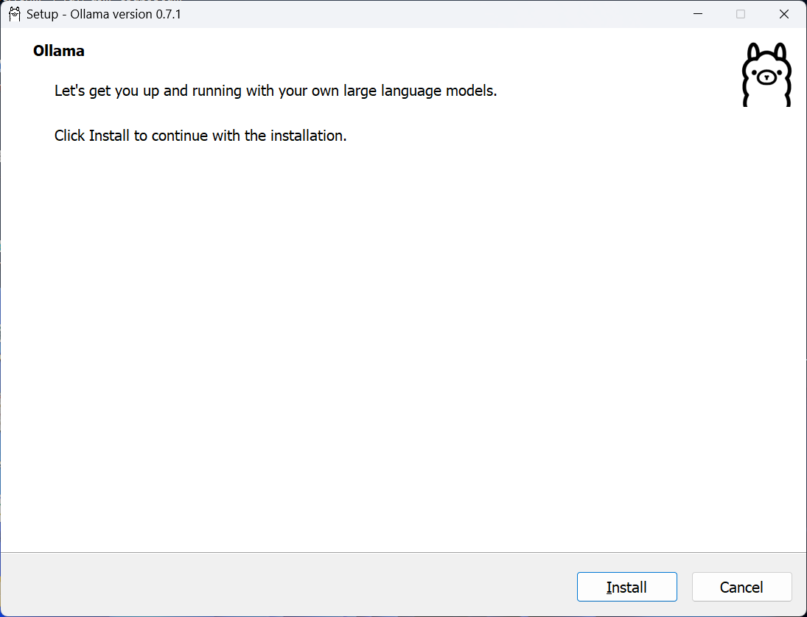

# 🛠️ C# Code Fixer using Local AI (Ollama + CodeLLaMA)

A powerful, privacy-focused tool built in **C#** that uses **local AI inference** (via [Ollama](https://ollama.com/) and models like **CodeLLaMA**) to **analyze**, **detect**, and **auto-correct** common C# code issues — all without needing an internet connection.

---

## 🚀 Features

- ✅ **Analyze C# Code** — Statistically reviews `.cs` source files for potential errors or bad practices.
- ✅ **Local AI Processing** — Powered by **Ollama**, no cloud APIs or data leakage.
- ✅ **Automatic Code Fixing** — Rewrites problematic code with corrected suggestions.
- ✅ **Drop-in Console Tool** — Simple to configure, integrates easily into your workflow or CI pipelines.
- ✅ **Flexible File Scanning** — Target specific extensions, exclude folders like `bin/obj`, and handle large codebases.

---

## 📁 Project Structure

```text
CSharpCodeFixerUsingLocalAI/
│
├── CSharpCodeFixer/              # Class Library project (core logic)
│   ├── CSharpCodeFixer.csproj
│   ├── CodeFixerExtension.cs     # Contains logic to scan, analyze, and auto-correct
│   ├── CorrectedFile.cs          # Model representing a corrected file
│   └── OllamaResponse.cs         # Model to deserialize Ollama response
│
├── CSharpCodeFixerUsingLocalAI/  # Console Application (entry point)
│   ├── CSharpCodeFixerUsingLocalAI.csproj
│   └── Program.cs 

CodesToAITesting/
│
├── Program.cs                    # Sample/test C# project to be analyzed (e.g., Console.WritLine("Hello World");)

```

## 🧠 How It Works

1. **Scan** your C# project directory and collect `.cs` files.
2. **Send** the code (within a character limit) to a **locally running Ollama API** using a model like `codellama`.
3. **Parse** the AI's structured response and extract corrected code if needed.
4. **Save** fixed files to an output folder or overwrite originals if desired.

> 📡 **No internet? No problem.** Your code never leaves your machine.

---

## ⚙️ How to Use

### 🔧 Setup

```bash
git clone https://github.com/ahmad-act/C-Sharp-Code-Fixer-using-Local-AI.git
cd CSharpCodeFixerUsingLocalAI
dotnet build
```

### 🧪 Example Usage

Edit `Program.cs` in the `CSharpCodeFixerUsingLocalAI` console app:

```csharp
string codebaseDirectory = @"D:\Path\To\Your\Project";
string outputDirectory = @"D:\Path\To\Save\CorrectedFiles";

var fileExtensions = new List<string> { ".cs" };
var excludedFolders = new List<string> { "bin", "obj" };

List<string> originalCodeFiles = codebaseDirectory.GetCodeFiles(fileExtensions, excludedFolder);

var correctedCodeFiles = await originalCodeFiles.GetCorrectedCodeFiles(outputDirectory, "codellama");

await originalCodeFiles.CorrectOriginalCodeFiles(correctedCodeFiles);

foreach (var correctedCodeFile in correctedCodeFiles)
{
    Console.WriteLine("FilePath: ", correctedCodeFile.FilePath);
    Console.WriteLine("AnalyzedResult: ", correctedCodeFile.AnalyzedResult);
}
```

Run the console app:

```bash
dotnet run --project CSharpCodeFixerUsingLocalAI
```

---

## 🧾 Output

For each analyzed file:
- If corrections are suggested, the file is saved in the **`outputDirectory`** directory.
- Logs are printed to the console showing the file path and AI response.

---

## 🧰 Requirements

Before getting started, ensure you have the following installed:

- [Python 3.8 or higher](https://www.python.org/downloads/)
- Bash (for script execution)
- [.NET 6.0 SDK](https://dotnet.microsoft.com/download/dotnet/6.0) or later
- [Ollama (v0.7.1+)](https://ollama.com)
- [`CodeLLaMA`  model (7B, 13B, or 34B)](https://ollama.com/search?q=codellama)

---

## ⚙️ Setup Instructions (Ollama + CodeLLaMA)

This guide explains how to install Ollama and use the CodeLLaMA model with a C# application.

---

### 1. Install Ollama

Ollama supports **Windows**, **macOS**, and **Linux**. Follow the instructions for your platform:

#### Windows

1. Download the Windows installer from the 
   - [Ollama download](https://ollama.com/download/windows) Click on: [`Download for Windows`](https://ollama.com/download/OllamaSetup.exe) File: `OllamaSetup.exe`.
  Or,
   - [Ollama GitHub Releases](https://github.com/ollama/ollama/releases) File: `ollama-windows-amd64.exe`.
   
2. Run the installer and follow the prompts.
   
3. Ollama will be set up as a service running at: [`http://localhost:11434`](http://localhost:11434)
  - Output on Browser: 
  ```browser
  Ollama is running
  ```

#### macOS

Install via Homebrew:
```bash
brew install ollama
```
Or manually download the `ollama-darwin` binary from the GitHub Releases.

#### Linux

Run the install script:
```bash
curl https://ollama.ai/install.sh | sh
```
Or manually download the binary and move it:
```bash
sudo mv ollama /usr/local/bin/ollama
```

---

### 2. Verify Installation
Run the following command to check if Ollama was installed correctly on Bash terminal:
```bash
$ ollama --version
```
You should see a version number, such as:
```bash
ollama version is 0.7.1
```

---

### 3. Pull the CodeLLaMA Model

The C# app uses the [`codellama`](https://ollama.com/search?q=codellama) model. CodeLLaMA is available in multiple sizes: 7B, 13B, and 34B.

#### Pull the Model using Bash terminal

Default (7B):
```bash
ollama pull codellama
```
Specific versions:
```bash
ollama pull codellama:13b
ollama pull codellama:34b
```

#### Check installed models
```bash
ollama list
```
Expected output:
```
codellama:latest
```

---

### 4. Run Ollama Server
Start the server (if required):
```bash
ollama serve
```
This launches the Ollama API server at:
```
http://localhost:11434
```

**Note for Windows:** If Ollama is installed as a service, it might already be running. Open `http://localhost:11434` in a browser. If it's working, you’ll see a message like:
```
Ollama is running.
```

Keep the server running while using the C# application.

---

### 5. Test the API
Run this command to verify the model is working:
```bash
curl http://localhost:11434/api/generate -d '{
  "model": "codellama",
  "prompt": "Hello, world!",
  "stream": false
}'
```
Expected response:
```json
{
  "response": "Hello! How can I help you today?",
  ...
}
```

## Additional Resources
- [Ollama Documentation](https://ollama.ai/docs)
- [CodeLlama Documentation](https://huggingface.co/codellama)
